<h2>📚 Descripción general:</h2>
 
Esta actividad consistió en la formulación de varias consultas a la base de datos AdventureWorks2022, identificando el comportamiento de cada una de las cláusulas Group by, Having, Over, Partition by y funciones 
Row number, Rank, Dense Rank entre otros conceptos.  
<h2>⚙️Tecnologías: </h2>
 
    • SQL Server  
 

<h2>🖇️ Fuente: </h2> 
AdventureWorks2022 es una muestra de base de datos disponible para descargar e instalar en Microsoft SQL Server.
 
  
<h2>Consultas realizadas: </h2>
 
▫️Cláusula group by: Agrupa la cantidad y el total vendidos por ID de producto.  

[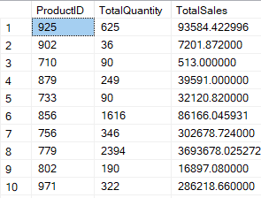](https://github.com/tdsTeresa/AdventureWorks2022_queries/blob/main/images1/Groupby.png)
  
▫️Clásula having: Aplica un filtro sobre la función de agregación suma (Total de órdenes > 50).   
[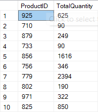](https://github.com/tdsTeresa/AdventureWorks2022_queries/blob/main/images1/Having.png)
  
▫️Cláusula over y partition by: Devuelve el monto por ID de orden.  
[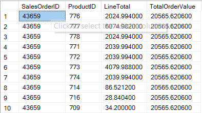](https://github.com/tdsTeresa/AdventureWorks2022_queries/blob/main/images1/Over_PartitionBy.png)
  
▫️Función row_number: Asigna un número único a cada fila dentro de su partición (por ID de orden).    
[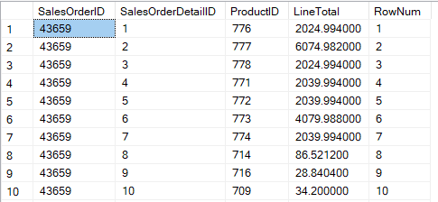](https://github.com/tdsTeresa/AdventureWorks2022_queries/blob/main/images1/RowNumber.png)  
▫️Función rank: Clasifica datos a partir del total por órden.  
[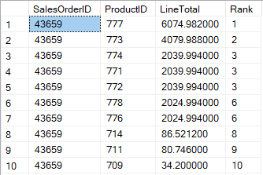](https://github.com/tdsTeresa/AdventureWorks2022_queries/blob/main/images1/Rank.png)
  
▫️Función DenseRank: Clasifica datos a partir del total por órden sin dejar espacios.  
[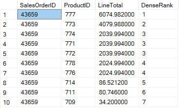](https://github.com/tdsTeresa/AdventureWorks2022_queries/blob/main/images1/DenseRank.png)
  
▫️Cláusula having.  
[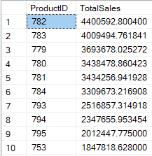](https://github.com/tdsTeresa/AdventureWorks2022_queries/blob/main/images1/Having2.png)
  
▫️Subconsulta: Datos de productos que han sido ordenados o vendidos.    
[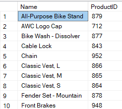](https://github.com/tdsTeresa/AdventureWorks2022_queries/blob/main/images1/Subconsulta.png)  
▫️Inner join: Concatenación del departamento de los empleados mediante conexiones de varios registros en las tablas.    
  
▫️CTE: Almacena de manera temporal el resultado de una consulta.     
[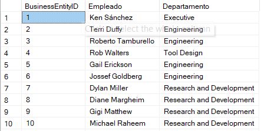]([https://github.com/tdsTeresa/AdventureWorks2022_queries/blob/main/images1/CTE.png)  
▫️isnull: Establece 'No disponible' en los registros sin un número de compra.    
[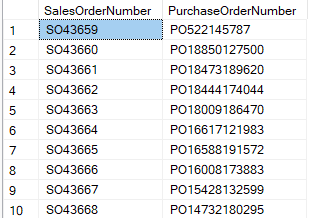]([https://github.com/tdsTeresa/AdventureWorks2022_queries/blob/main/images1/IsNull.png)  
▫️Substring: Devuelve un rango de caracteres de ciertas columnas.    
[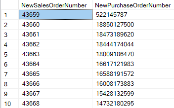]([https://github.com/tdsTeresa/AdventureWorks2022_queries/blob/main/images1/Substring.png)
  

